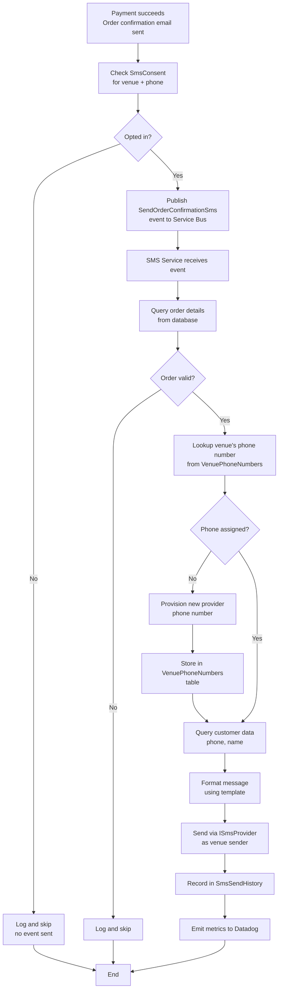
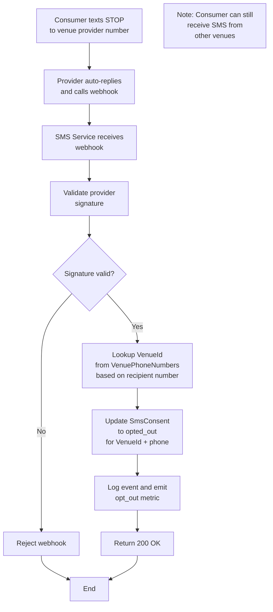

# TixTrack SMS Notification Service - Architecture Design

## Overview

A vendor-agnostic SMS notification service for sending order confirmation messages, designed to integrate with the existing TixTrack order flow while maintaining flexibility to swap SMS providers.

## Architecture Decisions

### Event-Driven Design
- **Trigger**: Thin event (`SendOrderConfirmationSms`) published to Azure Service Bus after order confirmation email is sent
- **Payload**: Minimal - just `OrderId` and `CustomerId`
- **Rationale**: Keeps coupling low while ensuring the SMS service retrieves current order state (avoids sending confirmations for cancelled orders)

### Data Access Strategy
- **Shared tables (read-only)**: Orders, Customers - accessed directly via the SMS service's data layer
- **Owned tables (read/write)**: `SmsConsent`, `SmsSendHistory` - managed exclusively by the SMS service
- **Rationale**: Pragmatic approach that avoids unnecessary API hops while maintaining clear domain ownership

### Provider Abstraction
- **Pattern**: Port/Adapter (Hexagonal Architecture)
- **Interface**: `ISmsProvider` with initial `TwilioSmsProvider` implementation
- **Rationale**: Enables swapping providers without modifying business logic

### Multi-Tenancy: Dedicated Phone Numbers per Venue
- **Strategy**: Each venue gets its own dedicated SMS provider phone number
- **Consumer Experience**: Ticket buyers always see the same sender number for each venue they interact with
- **Isolation**: Natural separation between venues - consumer buying tickets at multiple venues receives messages from different numbers
- **Compliance**: Each venue manages opt-outs independently (consumer can opt out of one venue but still receive from others)
- **Rationale**:
  - Better brand identity and trust (consistent sender per venue)
  - Simpler deliverability management (each venue has distinct sender reputation)
  - Phone number costs are negligible compared to B2B contract values
  - Cleaner compliance model (opt-outs are venue-specific, not customer-wide)

### Consent Management
- **SMS service owns all consent data** - not derived from user account flags
- **Consent scope**: Per-venue (consumer can opt out of one venue but remain opted in for others)
- **Initial consent**: Captured when user provides phone number during checkout (checkbox)
- **Opt-out handling**: Provider webhook updates local consent store for specific venue
- **Rationale**: Single source of truth for SMS channel; carrier-level opt-outs are captured via webhook; venue-scoped consent provides better consumer control

## Components

### SMS Notification Service (Azure Container Apps)

#### API Layer
| Endpoint | Method | Purpose |
|----------|--------|---------|
| `/webhook/twilio\|plivo` | POST | Receive STOP/START messages from SMS provider |
| `/api/consent/{venueId}/{phone}` | GET | Query consent status for venue (for other services) |
| `/api/history` | GET | Audit/compliance queries |

#### Service Layer
- **Service Bus Consumer**: Subscribes to `SendOrderConfirmationSms` topic
- **SMS Orchestrator**: Coordinates data retrieval, consent check, send, and history recording
- **Consent Service**: Manages opt-in/opt-out state
- **Template Engine**: Formats messages from templates + order data

#### Data Layer
- **Order Repository**: Read-only access to shared order/customer tables
- **Consent Repository**: CRUD for `SmsConsent` table
- **History Repository**: Write to `SmsSendHistory` table

### Database Tables (SMS-Owned)

```pseudocode
// Phone number assignments per venue
TABLE VenuePhoneNumbers
  id: UUID [primary key]
  venueId: UUID [required, unique when status = 'active']
  phoneNumber: String [E.164 format, indexed]
  providerId: String [provider-specific identifier, e.g., Twilio Phone Number SID]
  providerName: String ['twilio', 'plivo', etc.]
  status: String ['active', 'inactive', 'released']
  assignedAt: DateTime [required]
  releasedAt: DateTime [nullable]
  createdAt: DateTime [required]
  updatedAt: DateTime [required]

// Consent tracking (scoped to venue + consumer phone)
TABLE SmsConsent
  id: UUID [primary key]
  venueId: UUID [required, part of unique constraint]
  phoneNumber: String [required, part of unique constraint, indexed]
  status: String ['opted_in', 'opted_out']
  initialConsentSource: String ['checkout', 'account_settings', nullable]
  initialConsentAt: DateTime [nullable]
  optedOutAt: DateTime [nullable]
  optedInAt: DateTime [nullable]
  createdAt: DateTime [required]
  updatedAt: DateTime [required]

// Send history for audit/compliance
TABLE SmsSendHistory
  id: UUID [primary key]
  orderId: UUID [required, indexed]
  venueId: UUID [required, indexed]
  customerId: UUID [required]
  phoneNumber: String [consumer phone number, indexed]
  senderPhoneNumber: String [venue's provider number used to send]
  messageType: String ['order_confirmation']
  status: String ['sent', 'failed', 'skipped_no_consent', 'blocked_opted_out']
  providerMessageId: String [provider-specific message ID, nullable]
  providerName: String ['twilio', 'plivo', etc.]
  errorCode: String [nullable]
  errorMessage: String [nullable]
  createdAt: DateTime [required, indexed]
```

## Flows

### Order Confirmation SMS Flow



### Opt-Out Webhook Flow



### Error Handling
| Scenario | Action |
|----------|--------|
| Order cancelled | Skip, ack message |
| No consent | Skip, record in history |
| Provider 5xx error | Retry (nack message) |
| Provider opted-out error | Update consent, ack |
| Invalid phone error | Record failure, ack |

## Observability

### Datadog Metrics
- `sms.sent.total` - Counter by message_type, provider
- `sms.failed.total` - Counter by error_code, provider
- `sms.opt_out.total` - Counter
- `sms.opt_in.total` - Counter
- `sms.send.duration` - Histogram

### Application Insights
- Distributed tracing (correlation ID from Service Bus message)
- Structured logging for all operations
- Dependency tracking (database, SMS provider API)

### Alerts
- Send failure rate > 5%
- Webhook signature validation failures
- Provider API latency > 2s
- Dead letter queue depth > 0

## Future Extensibility

### Additional Message Types
Add new event types (e.g., `SendEventReminderSms`) and handlers without modifying core infrastructure.

### Additional Providers
Implement `ISmsProvider` for Plivo, MessageBird, etc. Provider selection can be configuration-driven.

### Multi-Region
Consent and history tables can be partitioned by region for UK/Australia expansion. Provider routing can be region-aware.
