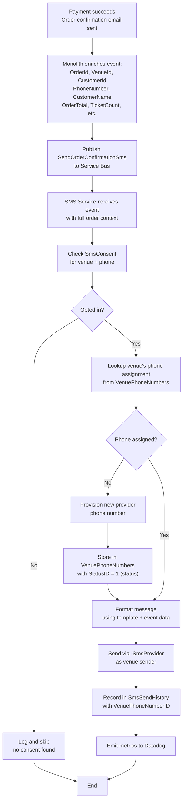
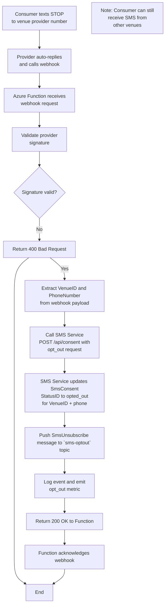

# SMS Notification Service - Architecture Design

## Current Implementation Status (January 2026)

### ✅ Completed Components
- **Project Structure**: Clean architecture with 4 projects (Api, Core, Infrastructure, Tests)
- **Health Checks**: `/healthz/live` and `/healthz/ready` endpoints operational
- **Provider Abstraction**: `ISmsProvider` interface with `PlivoSmsProvider` fully implemented
- **Plivo Integration**: HTTP-based SMS sending via Plivo API with error handling
- **Logging**: Structured logging with Serilog throughout the stack
- **Local Development**: Docker Compose setup for local testing

### 🏗️ In Progress
- **Database Schema**: SQL tables for enums, SmsConsent, SmsSendHistory, VenuePhoneNumbers
- **Domain Models**: Event and entity models for clean architecture
- **Entity Framework**: DbContext and repository configurations

### 📋 Upcoming
- **Service Bus Integration**: Azure Service Bus consumer for event processing
- **Domain Services**: ConsentService, SmsOrchestrator, HistoryService
- **Webhook Handler**: Provider opt-out webhook processing
- **API Endpoints**: Consent query and history endpoints
- **Twilio Provider**: Additional provider implementation

---

## Overview

A vendor-agnostic SMS notification service for sending order confirmation messages via multiple SMS providers (Plivo, Twilio, etc.), designed to integrate with order confirmation flows while maintaining flexibility to swap providers. The service manages consent per venue, tracks SMS delivery history for compliance, and handles provider webhooks for opt-out management.

## Architecture Decisions

### Event-Driven Design
- **Trigger**: Event (`SendOrderConfirmationSms`) published to Azure Service Bus after order confirmation email is sent
- **Payload**: Fatter message includes order details (OrderId, VenueId, CustomerId, PhoneNumber, CustomerName, OrderTotal, TicketCount, EventTimestamp)
- **Rationale**: Eliminates database coupling to monolith; SMS service is self-contained and doesn't need to query shared tables. Event producer enriches message with order context at time of confirmation.

### Data Access Strategy
- **Owned tables (read/write)**: `SmsConsent`, `SmsSendHistory`, `VenuePhoneNumbers` - managed exclusively by the SMS service
- **No external database reads**: Event payload contains all order/customer data needed; no queries to monolith tables
- **Rationale**: Eliminates schema coupling to monolith; SMS service remains independent and can scale autonomously. Order data treated as immutable within event context.

### Provider Abstraction
- **Pattern**: Port/Adapter (Hexagonal Architecture)
- **Interface**: `ISmsProvider` with implementations for `PlivoSmsProvider` and `TwilioSmsProvider`
- **Current Implementation**: `PlivoSmsProvider` fully implemented; can send SMS via Plivo API
- **Rationale**: Enables swapping providers without modifying business logic; clean separation of concerns

### Multi-Tenancy: Dedicated Phone Numbers per Venue
- **Strategy**: Each venue gets its own dedicated SMS provider phone number
- **Consumer Experience**: Ticket buyers always see the same sender number for each venue they interact with
- **Isolation**: Natural separation between venues - consumer buying tickets at multiple venues receives messages from different numbers
- **Compliance**: Each venue manages opt-outs independently (consumer can opt out of one venue but still receive from others)
- **Rationale**:
  - Better brand identity and trust (consistent sender per venue)
  - Simpler deliverability management (each venue has distinct sender reputation)
  - Phone number costs are negligible compared to B2B contract values
  - Cleaner compliance model (opt-outs are venue-specific, not customer-wide)

### Consent Management
- **SMS service owns all consent data** - not derived from user account flags
- **Consent scope**: Per-venue (consumer can opt out of one venue but remain opted in for others)
- **Initial consent**: Captured when user provides phone number during checkout (checkbox)
- **Opt-out handling**: Provider webhook (Azure Function) calls SMS Service internal endpoint to update consent
- **Rationale**: Single source of truth for SMS channel; carrier-level opt-outs are captured via webhook; venue-scoped consent provides better consumer control; separation of concerns (webhook gateway vs. business logic)

### Deployment Architecture
- **SMS Notification Service** (Azure Container Apps - Private Network)
  - Handles Service Bus events
  - Sends SMS messages
  - Owns consent business logic
  - Exposes internal REST API for consent updates
- **Webhook Handler** (Azure Function - Public)
  - Receives provider webhooks (STOP/START messages)
  - Validates provider signatures
  - Calls SMS Service internal endpoint to update consent
  - Lightweight adapter pattern - no business logic, only message validation and forwarding
- **Shared Database** (Azure SQL)
  - Both services access `SmsConsent`, `SmsSendHistory`, `VenuePhoneNumbers` tables

## Components

### SMS Notification Service (Azure Container Apps)

#### API Layer

**Public Endpoints (via Azure API Management or Application Gateway):**
| Endpoint | Method | Purpose |
|----------|--------|----------|
| `/api/consent/{venueId}/{phone}` | GET | Query consent status for venue (for other services) |
| `/api/history` | GET | Audit/compliance queries |

**Internal Endpoints (VNet-only, called by Azure Function):**
| Endpoint | Method | Purpose |
|----------|--------|----------|
| `/api/internal/consent/update` | POST | Update consent status from webhook (called by Azure Function) |

**Webhook Handler (Azure Function - Publicly Accessible):**
| Endpoint | Method | Purpose |
|----------|--------|----------|
| `/{provider}/webhook` | POST | Receive STOP/START messages from SMS provider, validate signature, forward to SMS Service |

#### Service Layer
- **Service Bus Consumer**: Subscribes to `SendOrderConfirmationSms` topic
- **SMS Orchestrator**: Coordinates data retrieval, consent check, send, and history recording
- **Consent Service**: Manages opt-in/opt-out state
- **Template Engine**: Formats messages from templates + order data

#### Data Layer
- **Consent Repository**: CRUD for `SmsConsent` table
- **History Repository**: Write to `SmsSendHistory` table
- **Phone Number Repository**: CRUD for `VenuePhoneNumbers` table

### Database Tables (SMS-Owned)

#### Enum/Lookup Tables

```pseudocode
// Provider names enumeration
TABLE ProviderNames
  ID: int [primary key]
  Name: varchar(50) [unique, 'twilio', 'plivo']
  IsActive: bit [default 1]
  CreatedAt: datetime2

// Venue phone number status enumeration
TABLE VenuePhoneNumberStatuses
  ID: int [primary key]
  Name: varchar(50) [unique, 'active', 'inactive', 'released']
  IsActive: bit [default 1]
  CreatedAt: datetime2

// SMS consent status enumeration
TABLE SmsConsentStatuses
  ID: int [primary key]
  Name: varchar(50) [unique, 'opted_in', 'opted_out']
  IsActive: bit [default 1]
  CreatedAt: datetime2

// Initial consent source enumeration
TABLE ConsentSources
  ID: int [primary key]
  Name: varchar(50) [unique, 'checkout', 'account_settings', 'support_request']
  IsActive: bit [default 1]
  CreatedAt: datetime2

// SMS send history status enumeration
TABLE SmsSendHistoryStatuses
  ID: int [primary key]
  Name: varchar(30) [unique, 'sent', 'failed', 'skipped_no_consent', 'blocked_opted_out']
  IsActive: bit [default 1]
  CreatedAt: datetime2
```

#### Business Tables

```pseudocode
// Phone number assignments per venue
TABLE VenuePhoneNumbers
  ID: int [primary key]
  VenueID: int [required, FK to Venue.ID, part of unique constraint with ProviderNameID]
  PhoneNumber: varchar(20) [E.164 format, required, indexed]
  ProviderID: varchar(100) [provider-specific identifier, e.g., Twilio Phone Number SID, required]
  ProviderNameID: int [FK to ProviderNames.ID, required]
  StatusID: int [FK to VenuePhoneNumberStatuses.ID, required]
  AssignedAt: datetime2 [required]
  ReleasedAt: datetime2 [nullable]
  CreatedAt: datetime2 [required]
  UpdatedAt: datetime2 [required]
  UNIQUE INDEX: (VenueID, ProviderNameID) WHERE StatusID = 1 [active]

// Consent tracking (scoped to venue + consumer phone)
TABLE SmsConsent
  ID: int [primary key]
  VenueID: int [required, FK to Venue.ID, part of unique constraint]
  PhoneNumber: varchar(20) [required, part of unique constraint, indexed, E.164 format]
  StatusID: int [FK to SmsConsentStatuses.ID, required]
  ConsentSourceID: int [FK to ConsentSources.ID, nullable]
  InitialConsentAt: datetime2 [nullable]
  OptedOutAt: datetime2 [nullable]
  OptedInAt: datetime2 [nullable]
  CreatedAt: datetime2 [required]
  UpdatedAt: datetime2 [required]
  UNIQUE INDEX: (VenueID, PhoneNumber)

// Send history for audit/compliance
TABLE SmsSendHistory
  ID: bigint [primary key] [supports millions of SMS records]
  OrderID: uniqueidentifier [required, indexed]
  VenueID: int [required, FK to Venue.ID, indexed]
  VenuePhoneNumberID: int [required, FK to VenuePhoneNumbers.ID] [reference to venue's assigned phone]
  CustomerID: uniqueidentifier [required]
  CustomerPhoneNumber: varchar(20) [consumer phone number, required, indexed, E.164 format]
  Message: varchar(500) [SMS content sent, required]
  ProviderNameID: int [FK to ProviderNames.ID, required]
  StatusID: int [FK to SmsSendHistoryStatuses.ID, required]
  ProviderMessageID: varchar(100) [provider-specific message tracking ID, nullable]
  ErrorCode: varchar(50) [provider error code if failed, nullable]
  CreatedAt: datetime2 [required, indexed for time-range queries]
  INDEX: (VenueID, CreatedAt) [for compliance queries]
  INDEX: (CustomerPhoneNumber, VenueID) [for customer SMS history]
```

## Flows

### Order Confirmation SMS Flow



### Opt-Out Webhook Flow



### Error Handling
| Scenario | Action |
|----------|--------|
| Order cancelled | Skip, ack message |
| No consent | Skip, record in history |
| Provider 5xx error | Retry (nack message) |
| Provider opted-out error | Update consent, ack |
| Invalid phone error | Record failure, ack |

## Observability

### Datadog Metrics
- `sms.sent.total` - Counter by message_type, provider
- `sms.failed.total` - Counter by error_code, provider
- `sms.opt_out.total` - Counter
- `sms.opt_in.total` - Counter
- `sms.send.duration` - Histogram

### Application Insights
- Distributed tracing (correlation ID from Service Bus message)
- Structured logging for all operations
- Dependency tracking (database, SMS provider API)

### Alerts
- Send failure rate > 5%
- Webhook signature validation failures
- Provider API latency > 2s
- Dead letter queue depth > 0

## Future Extensibility

### Additional Message Types
Add new event types (e.g., `SendEventReminderSms`) and handlers without modifying core infrastructure.

### Additional Providers
Implement `ISmsProvider` for Plivo, MessageBird, etc. Provider selection can be configuration-driven.

### Multi-Region
Consent and history tables can be partitioned by region for UK/Australia expansion. Provider routing can be region-aware.
