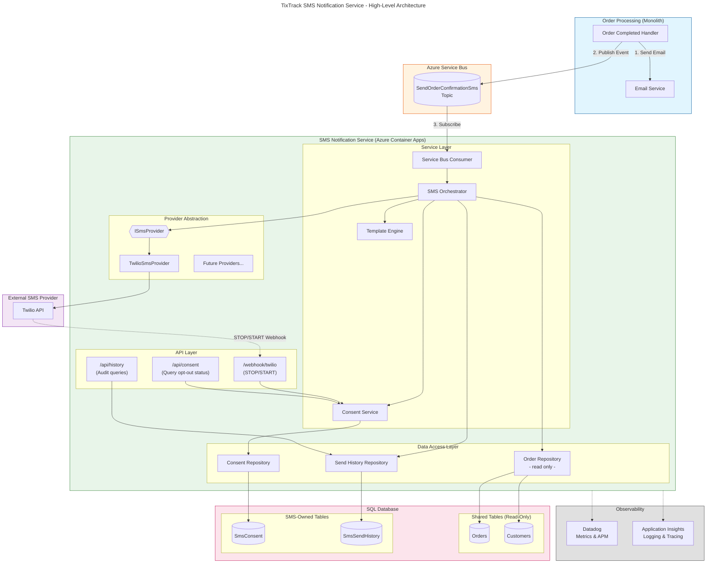

```mermaid
---
title: TixTrack SMS Notification Service - High-Level Architecture
---
flowchart TB
    subgraph Monolith["Order Processing (Monolith)"]
        OH[Order Completed Handler]
        EMAIL[Email Service]
    end

    subgraph MessageBus["Azure Service Bus"]
        TOPIC[("SendOrderConfirmationSms<br/>Topic")]
    end

    subgraph SMSService["SMS Notification Service (Azure Container Apps)"]
        subgraph API["API Layer"]
            WEBHOOK["/webhook/twilio<br/>(STOP/START)"]
            CONSENT_API["/api/consent<br/>(Query opt-out status)"]
            HISTORY_API["/api/history<br/>(Audit queries)"]
        end
        
        subgraph ServiceLayer["Service Layer"]
            CONSUMER[Service Bus Consumer]
            ORCHESTRATOR[SMS Orchestrator]
            CONSENT_SVC[Consent Service]
            TEMPLATE[Template Engine]
        end
        
        subgraph ProviderAbstraction["Provider Abstraction"]
            INTERFACE{{"ISmsProvider"}}
            TWILIO[TwilioSmsProvider]
            FUTURE[Future Providers...]
        end
        
        subgraph DataLayer["Data Access Layer"]
            ORDER_REPO[Order Repository<br/>- read only -]
            CONSENT_REPO[Consent Repository]
            HISTORY_REPO[Send History Repository]
        end
    end

    subgraph Database["SQL Database"]
        subgraph SharedTables["Shared Tables (Read-Only)"]
            ORDERS[(Orders)]
            CUSTOMERS[(Customers)]
        end
        subgraph OwnedTables["SMS-Owned Tables"]
            SMS_CONSENT[(SmsConsent)]
            SMS_HISTORY[(SmsSendHistory)]
        end
    end

    subgraph ExternalProviders["External SMS Provider"]
        TWILIO_API[Twilio API]
    end

    subgraph Observability["Observability"]
        DATADOG[Datadog<br/>Metrics & APM]
        APPINSIGHTS[Application Insights<br/>Logging & Tracing]
    end

    %% Order Flow
    OH -->|1. Send Email| EMAIL
    OH -->|2. Publish Event| TOPIC
    TOPIC -->|3. Subscribe| CONSUMER
    
    %% SMS Service Internal Flow
    CONSUMER --> ORCHESTRATOR
    ORCHESTRATOR --> ORDER_REPO
    ORCHESTRATOR --> CONSENT_SVC
    CONSENT_SVC --> CONSENT_REPO
    ORCHESTRATOR --> TEMPLATE
    ORCHESTRATOR --> INTERFACE
    INTERFACE --> TWILIO
    TWILIO --> TWILIO_API
    ORCHESTRATOR --> HISTORY_REPO
    
    %% Data Access
    ORDER_REPO --> ORDERS
    ORDER_REPO --> CUSTOMERS
    CONSENT_REPO --> SMS_CONSENT
    HISTORY_REPO --> SMS_HISTORY
    
    %% Webhook Flow
    TWILIO_API -.->|STOP/START Webhook| WEBHOOK
    WEBHOOK --> CONSENT_SVC
    
    %% External API Access
    CONSENT_API --> CONSENT_SVC
    HISTORY_API --> HISTORY_REPO
    
    %% Observability
    SMSService -.-> DATADOG
    SMSService -.-> APPINSIGHTS

    %% Styling
    classDef monolith fill:#e1f5fe,stroke:#01579b
    classDef bus fill:#fff3e0,stroke:#e65100
    classDef smsservice fill:#e8f5e9,stroke:#2e7d32
    classDef database fill:#fce4ec,stroke:#c2185b
    classDef external fill:#f3e5f5,stroke:#7b1fa2
    classDef observability fill:#e0e0e0,stroke:#424242
    
    class Monolith monolith
    class MessageBus bus
    class SMSService smsservice
    class Database database
    class ExternalProviders external
    class Observability observability
```