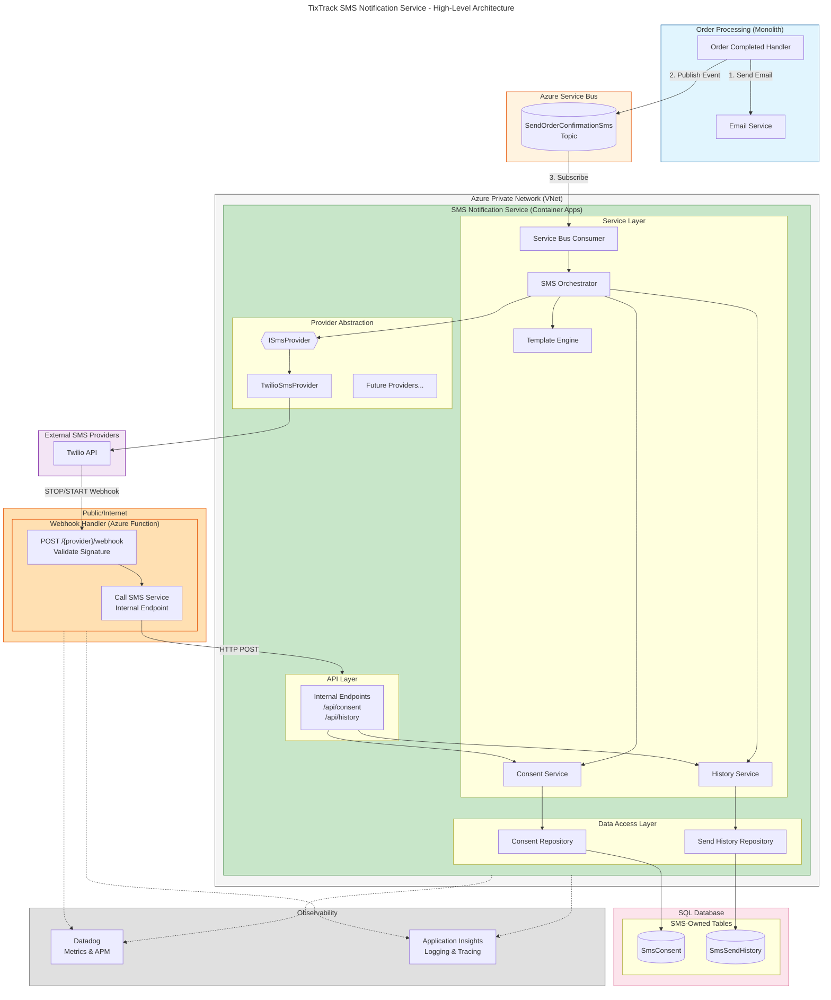

```mermaid
---
title: TixTrack SMS Notification Service - High-Level Architecture
---
flowchart TB
    subgraph Monolith["Order Processing (Monolith)"]
        OH[Order Completed Handler]
        EMAIL[Email Service]
    end

    subgraph MessageBus["Azure Service Bus"]
        TOPIC[("SendOrderConfirmationSms<br/>Topic")]
    end

    subgraph PrivateNetwork["Azure Private Network (VNet)"]
        subgraph SMSService["SMS Notification Service (Container Apps)"]
            subgraph API["API Layer"]
                INTERNAL_API["Internal Endpoints<br/>/api/consent<br/>/api/history"]
            end
            
            subgraph ServiceLayer["Service Layer"]
                CONSUMER[Service Bus Consumer]
                ORCHESTRATOR[SMS Orchestrator]
                CONSENT_SVC[Consent Service]
                HISTORY_SVC[History Service]
                TEMPLATE[Template Engine]
            end
            
            subgraph ProviderAbstraction["Provider Abstraction"]
                INTERFACE{{"ISmsProvider"}}
                TWILIO[TwilioSmsProvider]
                FUTURE[Future Providers...]
            end
            
            subgraph DataLayer["Data Access Layer"]
                CONSENT_REPO[Consent Repository]
                HISTORY_REPO[Send History Repository]
            end
        end
    end

    subgraph PublicNetwork["Public/Internet"]
        subgraph WebhookFunction["Webhook Handler (Azure Function)"]
            WEBHOOK_RECEIVER["POST /{provider}/webhook<br/>Validate Signature"]
            WEBHOOK_CALLER["Call SMS Service<br/>Internal Endpoint"]
        end
    end

    subgraph Database["SQL Database"]
        subgraph OwnedTables["SMS-Owned Tables"]
            SMS_CONSENT[(SmsConsent)]
            SMS_HISTORY[(SmsSendHistory)]
        end
    end

    subgraph ExternalProviders["External SMS Providers"]
        TWILIO_API[Twilio API]
    end

    subgraph Observability["Observability"]
        DATADOG[Datadog<br/>Metrics & APM]
        APPINSIGHTS[Application Insights<br/>Logging & Tracing]
    end

    %% Order Flow
    OH -->|1. Send Email| EMAIL
    OH -->|2. Publish Event| TOPIC
    TOPIC -->|3. Subscribe| CONSUMER
    
    %% SMS Service Internal Flow
    CONSUMER --> ORCHESTRATOR
    ORCHESTRATOR --> CONSENT_SVC
    CONSENT_SVC --> CONSENT_REPO
    ORCHESTRATOR --> HISTORY_SVC
    HISTORY_SVC --> HISTORY_REPO
    ORCHESTRATOR --> TEMPLATE
    ORCHESTRATOR --> INTERFACE
    INTERFACE --> TWILIO
    TWILIO --> TWILIO_API
    
    %% Data Access
    CONSENT_REPO --> SMS_CONSENT
    HISTORY_REPO --> SMS_HISTORY
    
    %% Webhook Flow (Function to Service)
    TWILIO_API -->|STOP/START Webhook| WEBHOOK_RECEIVER
    WEBHOOK_RECEIVER --> WEBHOOK_CALLER
    WEBHOOK_CALLER -->|HTTP POST| API
    
    %% API Access
    INTERNAL_API --> CONSENT_SVC
    INTERNAL_API --> HISTORY_SVC
    
    %% Observability
    SMSService -.-> DATADOG
    SMSService -.-> APPINSIGHTS
    WebhookFunction -.-> DATADOG
    WebhookFunction -.-> APPINSIGHTS

    %% Styling
    classDef monolith fill:#e1f5fe,stroke:#01579b
    classDef bus fill:#fff3e0,stroke:#e65100
    classDef smsservice fill:#c8e6c9,stroke:#2e7d32
    classDef private fill:#f5f5f5,stroke:#424242
    classDef public fill:#ffe0b2,stroke:#e65100
    classDef database fill:#fce4ec,stroke:#c2185b
    classDef external fill:#f3e5f5,stroke:#7b1fa2
    classDef observability fill:#e0e0e0,stroke:#424242
    
    class Monolith monolith
    class MessageBus bus
    class PrivateNetwork private
    class SMSService smsservice
    class PublicNetwork public
    class WebhookFunction public
    class Database database
    class ExternalProviders external
    class Observability observability
```